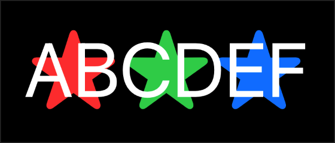
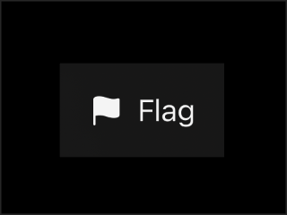
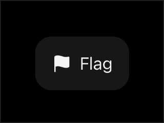
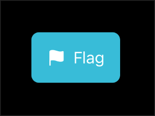
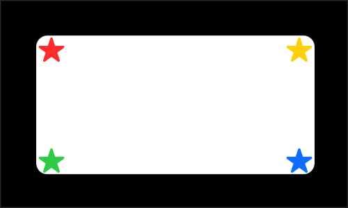
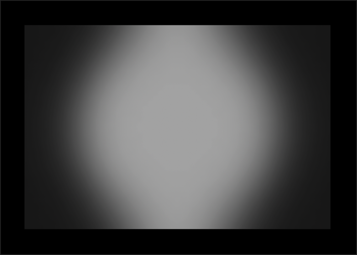
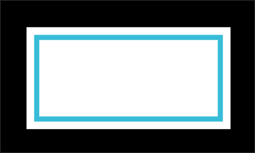

# Background and Overlay

## Background

- 현재 view 뒤에 `View`를 배치한다.

### background(alignment:content:)

```swift
func background<V>(
    alignment: Alignment = .center, 
    @ViewBuilder content: () -> V
) -> some View where V : View
```

- 현재 view의 background에 view를 배치하고, 영역 안애서 위치를 변경할 수 있다. (uses to position the implicit ZStack)
- 예시
    ```swift
    struct Star: View {
        var color: Color
        var body: some View {
            Image(systemName: "star.fill")
                .foregroundStyle(color)
        }
    }

    Text("ABCDEF")
        .background(alignment: .leading) { Star(color: .red) }
        .background(alignment: .center) { Star(color: .green) }
        .background(alignment: .trailing) { Star(color: .blue) }
    ```
    <p></p>

### background(_:ignoresSafeAreaEdges:)

```swift
func background<S>(
    _ style: S,
    ignoresSafeAreaEdges edges: Edge.Set = .all
) -> some View where S : ShapeStyle
```

- `style` : 현재 view의 background를 `ShapeStyle`로 설정한 `View`를 반환한다.
- `ignoresSafeAreaEdges` : Background가 safe area를 벗어날 때, safe area를 무시할 edge를 설정한다.
- 예시 1
    ```swift
    struct FlagLabel: View {
        var body: some View {
            Label("Flag", systemImage: "flag.fill")
                .padding()
                .background(.regularMaterial)
        }
    }
    ```
    <p></p>
- 예시 2
    ```swift
    FlagLabel()
        .containerShape(RoundedRectangle(cornerRadius: 16))
    ```
    <p></p>

### background(_:in:fillStyle:)

```swift
func background<S, T>(
    _ style: S,
    in shape: T,
    fillStyle: FillStyle = FillStyle()
) -> some View where S : ShapeStyle, T : Shape
```

- `style` : 현재 view의 background를 `FillStyle`로 채워진 `ShapeStyle`로 설정한 `View`를 반환한다.
- `shape` : Background에 그릴 `Shape`. (e.g. `Circle`, `Rectangle`)
- 예시
    ```swift
    Label("Flag", systemImage: "flag.fill")
        .padding()
        .background(.teal, in: RoundedRectangle(cornerRadius: 8))
    ```
    <p></p>

## Overlay

- 현재 view의 앞에 `View`를 배치한다.

### overlay(alignment:content:)

```swift
func overlay<V>(
    alignment: Alignment = .center, 
    @ViewBuilder content: () -> V
) -> some View where V : View
```

- 현재 view의 front layer에 view를 배치하고, 영역 안애서 위치를 변경할 수 있다. (uses to position the implicit ZStack)
- 예시
    ```swift
    RoundedRectangle(cornerRadius: 8)
        .frame(width: 200, height: 100)
        .overlay(alignment: .topLeading) { Star(color: .red) }
        .overlay(alignment: .topTrailing) { Star(color: .yellow) }
        .overlay(alignment: .bottomLeading) { Star(color: .green) }
        .overlay(alignment: .bottomTrailing) { Star(color: .blue) }
    ```
    <p></p>

### overlay(_:ignoresSafeAreaEdges:)

```swift
func overlay<S>(
    _ style: S,
    ignoresSafeAreaEdges edges: Edge.Set = .all
) -> some View where S : ShapeStyle
```

- `style` : 현재 view의 front layer에 `ShapeStyle`를 설정한 `View`를 반환한다.
- `ignoresSafeAreaEdges` : Overlay로 추가한 view가 safe area를 벗어날 때, safe area를 무시할 edge를 설정한다.
- 예시
    ```swift
    struct CoveredCircle: View {
        var body: some View {
            Circle()
                .frame(width: 300, height: 200)
                .overlay(.ultraThinMaterial)
        }
    }
    ```
    <p></p>

### overlay(_:in:fillStyle:)

```swift
func overlay<S, T>(
    _ style: S,
    in shape: T,
    fillStyle: FillStyle = FillStyle()
) -> some View where S : ShapeStyle, T : Shape
```

- `style` : 현재 view의 front layer에 `FillStyle`로 채워진 `ShapeStyle`로 설정한 `View`를 반환한다.
- `shape` : Front layer에 그릴 `Shape`. (e.g. `Circle`, `Rectangle`)
- 예시
    ```swift
    Rectangle()
        .frame(width: 200, height: 100)
        .overlay(.teal, in: Rectangle().inset(by: 10).stroke(lineWidth: 5))
    ```
    <p></p>

## 사용 예시

```swift
Image(systemName: "heart.fill")
    .font(.system(size: 40))
    .foregroundColor(.white)
    .background(
        // 1.
        Circle()
            // 2.
            .fill(
                LinearGradient(
                    gradient: Gradient(
                        colors: [Color(red: 0.5, green: 0.3, blue: 0.9), Color(red: 0.3, green: 0.06, blue: 0.9)]
                    ),
                    startPoint: .topLeading,
                    endPoint: .bottomTrailing
                )
            )
            .frame(width: 100, height: 100)
            .shadow(
                color: Color(red: 0.5, green: 0.3, blue: 0.9, opacity: 0.5),
                radius: 10,
                x: 0,
                y: 10
            )
            // 3.
            .overlay(alignment: .bottomTrailing) {
                Circle()
                    .fill(.blue)
                    .frame(width: 35, height: 35)
                    // 4.
                    .overlay(
                        Text("5")
                            .font(.headline)
                            .foregroundColor(.white)
                    )
                    .shadow(
                        color: Color(red: 0.5, green: 0.3, blue: 0.9, opacity: 0.5),
                        radius: 10,
                        x: 5,
                        y: 5
                    )
            }
    )
```

<p></p>

1. Heart image의 background layer에 `Circle` shape 추가
2. Background circle의 색을 gradient로 채움
3. Heart image의 overlay layer에 `Circle` shape 추가. `alignment`가 `.bottomTrailing`이므로, 이 파란색 circle은 오른쪽 아래에 위치함
4. 3번의 파란색 `Circle`의 overlay layer에 `Text`(`View`) 추가