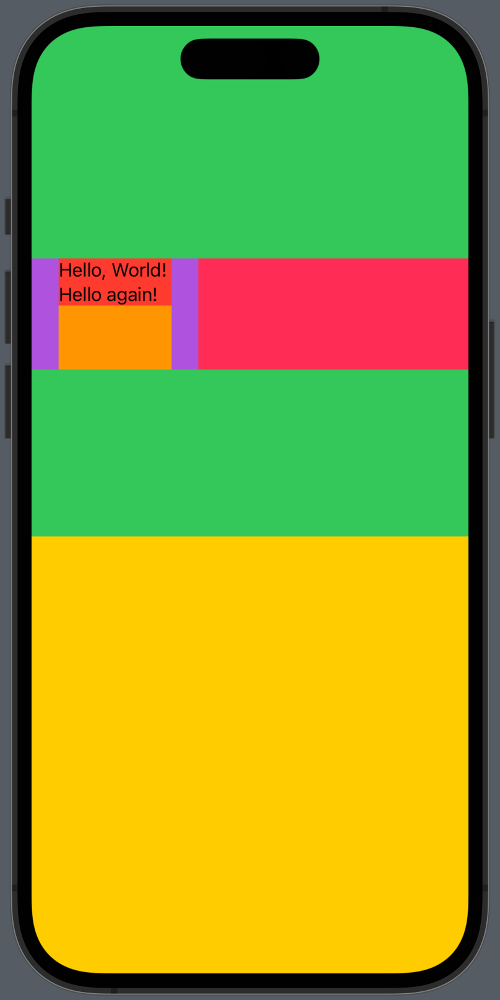

# Frame

- 현재 view를 배치할 수 있는 frame 영역을 가진 또 다른 `View`를 반환한다.

## Fixed Frame

```swift
func frame(
    width: CGFloat? = nil,
    height: CGFloat? = nil,
    alignment: Alignment = .center
) -> some View
```

- 보이지 않는(invisible) 고정된 size(width, height)의 frame을 만들고, `View`를 그 안에 배치한다.
- **Content와 관계 없이 항상 고정된 size를 유지한다.**
- Arguments
    - `width` : Resulting view의 고정된 width
    - `height` : Resulting view의 고정된 height
    - `alignment` : Resulting frame 안에서 현재 view의 정렬 방식

## Flexible Frame

```swift
func frame(
    minWidth: CGFloat? = nil,
    idealWidth: CGFloat? = nil,
    maxWidth: CGFloat? = nil,
    minHeight: CGFloat? = nil,
    idealHeight: CGFloat? = nil,
    maxHeight: CGFloat? = nil,
    alignment: Alignment = .center
) -> some View
```

- `frame(width:height:alignment:)`와 차이 : 크기 제약(size constraints)에 의한 가변적인 frame size를 지정할 수 있다.
- 이 method를 사용하면, 지정하지 않은 값들에 `nil`이 기본값으로 할당되며, 이 때는 `nil`이 아닌 다른 argument에 의해 결정되는 sizing behavior를 따른다.
- Arguments
    - `minWidth`, `minHeight` : 최소 크기 제약
    - `maxWidth`, `maxHeight` : 최대 크기 제약
    - `idealWidth`, `idealHeight` : 이상적인 크기. `fixedSize()`와 함께 사용하면, `idealWidth`와 `idealHeight`으로 고정된다.
    - `alignment` : Resulting frame 안에서 현재 view의 정렬 방식
- 적용 순서
    1. Max size에 `nil`이 아닌 값을 설정하면 `maxWidth`, `maxHeight`이 우선 적용된다.
    2. Max size에 `nil`을 설정하고 min size에 `nil`이 아닌 값을 설정하면 `minWidth`, `minHeight`이 우선 적용된다.
    3. Ideal size는 실제 size에 영향을 주지 않는다. 
        - Content에 따라 frame size가 가변적으로 변한다.
        - `fixedSize()` modifier를 사용하면 ideal size로 고정된다.

## 응용

```swift
Text("Hello, World! Hello again!")
    .background(.red)                                   // 1.
    .frame(height: 100, alignment: .top)                // 2.
    .background(.orange)                                // 3.
    .frame(width: 150)                                  // 4.
    .background(.purple)                                // 5.
    .frame(maxWidth: .infinity, alignment: .leading)    // 6.
    .background(.pink)                                  // 7.
    .frame(height: 400)                                 // 8.
    .background(.green)                                 // 9.
    .frame(maxHeight: .infinity, alignment: .top)       // 10.
    .background(.yellow)                                // 11.
    .ignoresSafeArea(edges: [])
```

1. Content에 딱 맞는 영역 background 설정 (red)
2. Frame height을 100으로 고정하고, 현재 view를 top으로 배치
3. 2번에서 변경된 frame 영역에 background 설정 (orange)
4. Frarme width를 150으로 고정. Alignment 지정하지 않으면 center 배치
5. 4번에서 변경된 frame 영역에 background 설정 (purple)
6. Frame width를 최대 제약으로 설정하고, 현재 view를 leading alignment로 배치
7. 6번에서 변경된 frame 영역에 background 설정 (pink)
8. Frame height을 400으로 고정. Alignment 지정하지 않으면 center 배치
9. 8번에서 변경된 frame 영역에 background 설정 (green)
10. Frame height을 최대 제약으로 설정하고, 현재 view를 top alignment로 배치
11. 10번에서 변경된 frame 영역에 background 설정 (yellow)

<p></p>

# Reference

- https://swiftwithmajid.com/2021/06/02/frames-in-swiftui/
- https://swiftwithmajid.com/2020/04/15/layout-priorities-in-swiftui/