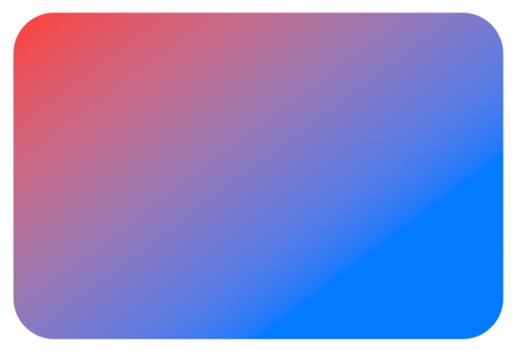

# Gradient

- Color array로 gradient를 표현하는 타입
- Color만 사용하면 균일하게 분배한다.
    ```swift
    RoundedRectangle(cornerRadius: 25)
        .fill(
            LinearGradient(
                gradient: Gradient(colors: [Color.red, Color.blue]),
                startPoint: .topLeading,
                endPoint: .bottom
            )
        )
        .frame(width: 300, height: 200)
    ```
    <p></p>
- Color마다 location을 지정할 수도 있다. (0 ~ 1)
    ```swift
    RoundedRectangle(cornerRadius: 25)
        .fill(
            LinearGradient(
                gradient: Gradient(stops: [.init(color: .red, location: 0.5), .init(color: .blue, location: 1)]),
                startPoint: .topLeading,
                endPoint: .bottom
            )
        )
        .frame(width: 300, height: 200)
    ```
    <p></p>

## LinearGradient

- `startPoint` ~ `endPoint`까지 gradient를 균일하게 펼친다.

<p></p>

```swift
RoundedRectangle(cornerRadius: 25)
    .fill(
        LinearGradient(
            gradient: Gradient(colors: [.red, .blue]),
            startPoint: .topLeading,
            endPoint: .bottomTrailing
        )
    )
    .frame(width: 300, height: 200)
```

## RadialGradient

- `center`로부터 `startRadius`까지 첫 번쨰 색상으로 채움
- `gradient`의 두 번째 색상부터 `endRadius`만큼 gradient를 추가해 나간다.
- `gradient`의 마지막 색상은 `endRadius`만큼 gradient를 채우고, 이후는 static color로 채운다.

<p></p>

```swift
RoundedRectangle(cornerRadius: 25)
    .fill(
        RadialGradient(
            gradient: Gradient(colors: [.red, .blue]),
            center: .center,
            startRadius: 5,
            endRadius: 150
        )
    )
    .frame(width: 300, height: 200)
```

## AngularGradient

- `center`를 기준으로 `angle`만큼 이동한 각도에서 gradient를 시작한다.
- 3시 방향이 0도
- 예시에서는 180도로 설정했기 때문에 9시 방향에서 시계 방향으로 gradient가 적용된다.

<p></p>

```swift    
RoundedRectangle(cornerRadius: 25)
    .fill(
        AngularGradient(
            gradient: Gradient(colors: [.red, .blue]),
            center: .center,
            angle: .degrees(180)
        )
    )
```

## 응용

<p></p>

```swift
VStack {
    RoundedRectangle(cornerRadius: 25)
        .fill(
            LinearGradient(
                gradient: Gradient(colors: [.red, .blue]),
                startPoint: .topLeading,
                endPoint: .bottom
            )
        )
        .frame(width: 300, height: 200)
    
    RoundedRectangle(cornerRadius: 25)
        .fill(
            RadialGradient(
                gradient: Gradient(colors: [.red, .blue]),
                center: .leading,
                startRadius: 5,
                endRadius: 400
            )
        )
        .frame(width: 300, height: 200)
    
    RoundedRectangle(cornerRadius: 25)
        .fill(
            AngularGradient(
                gradient: Gradient(colors: [.red, .blue]),
                center: .topLeading,
                angle: .degrees(180 + 45)
            )
        )
        .frame(width: 300, height: 200)
}
```