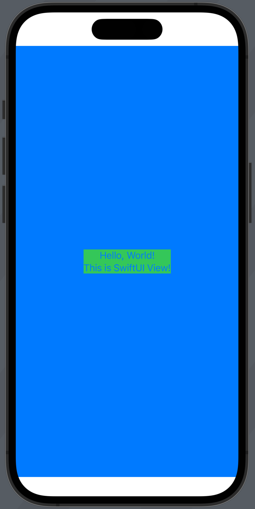

# UIHostingViewController

SwiftUI view를 UIKit view hierarchy에 integrate 하기 위한 view controller

```swift
@available(iOS 13.0, tvOS 13.0, *)
@available(macOS, unavailable)
@available(watchOS, unavailable)
@MainActor open class UIHostingController<Content> : UIViewController where Content : View {
    /// Creates a hosting controller object that wraps the specified SwiftUI
    /// view.
    ///
    /// - Parameter rootView: The root view of the SwiftUI view hierarchy that
    ///   you want to manage using the hosting view controller.
    ///
    /// - Returns: A `UIHostingController` object initialized with the
    ///   specified SwiftUI view.
    @MainActor public init(rootView: Content)

    ...
}
```

## Present SwiftUI view in UIKit view hierarchy

1. SwiftUI view 구현
    ```swift
    struct SwiftUIView: View {
        var body: some View {
            ZStack {
                Color.blue
                Text("Hello, World!\nThis is SwiftUI View!")
                    .multilineTextAlignment(.center)
                    .background(.green)
            }
        }
    }
    ```
2. UIKit에서 present에 사용할 button을 만들고, action 연결
    ```swift
    class ViewController: UIViewController {
        override func viewDidLoad() {
            super.viewDidLoad()
            
            let presentButton = UIButton(type: .system)
            presentButton.addTarget(self, action: #selector(buttonTouched(_:)), for: .touchUpInside)
            presentButton.setTitle("Present SwiftUI View", for: .normal)
            view.addSubview(presentButton)
            presentButton.translatesAutoresizingMaskIntoConstraints = false
            NSLayoutConstraint.activate([
                presentButton.centerXAnchor.constraint(equalTo: view.centerXAnchor),
                presentButton.centerYAnchor.constraint(equalTo: view.centerYAnchor)
            ])
        }
        
        @objc func buttonTouched(_ sender: UIButton) {
            // present
        }
    }
    ```
3. `UIHostingViewController`를 사용해서 SwiftUI view를 wrapping한 뒤 present
    ```swift
    @objc func buttonTouched(_ sender: UIButton) {
        let viewController = UIHostingController(rootView: SwiftUIView())
        present(viewController, animated: true)
    }
    ```
4. 실행 결과
    <p></p>

## Pass data and action between UIKit and SwiftUI views

Combine을 사용해서 data 및 action이 동적으로 연결되도록 만든다.

1. ObservableObject 구현. UIKit에서 SwiftUI로 `action`을 전달하고, SwiftUI에서 UIKit으로 `data`를 전달할 것이다.
    ```swift
    class ObservableData: ObservableObject {
        @Published var data = ""
        var action: (() -> Void)?   
    }
    ```
2. SwiftUI view에서 `ObservableData`를 `@ObservedObject`로 만들고 stream을 연결한다.
    ```swift
    struct SwiftUIView: View {
        @ObservedObject var observable: ObservableData        
        var body: some View {
            ZStack {
                Color.blue
                Button("Hello, World!\nThis is SwiftUI View!") {
                    observable.data = "From SwiftUI View"
                    observable.action?()
                }
                .multilineTextAlignment(.center)
                .background(.green)
            }
        }
    }
    ```
2. UIKit view에서 `observableData`를 만들고 stream을 연결한다.
    ```swift
    class ViewController: UIViewController {

        let observableData = ObservableData()
        var cancellables = Set<AnyCancellable>()

        override func viewDidLoad() {
            super.viewDidLoad()
            
            ...

            observableData.$data
                .sink { value in
                    print("Data From SwiftUI : \(value)")
                }
                .store(in: &cancellables)
            
            observableData.action = {
                print("Action From UIKit")
            }
        }
        
        @objc func buttonTouched(_ sender: UIButton) {
            let viewController = UIHostingController(rootView: SwiftUIView(observable: observableData))
            present(viewController, animated: true)
        }
    }
    ```
4. SwiftUI view에서 버튼을 터치할 때 발생하는 일
    1. `data`가 변경 -> `observableData.$data.sink(receivedValue:)`로 변경된 data가 들어옴 -> UIKit에서 console에 data 출력
    2. `action` closure 호출 -> UIKit에서 console에 출력


# Reference

- https://developer.apple.com/documentation/swiftui/uihostingcontroller
- https://stackoverflow.com/questions/66204509/passing-data-from-swiftui-to-uikit