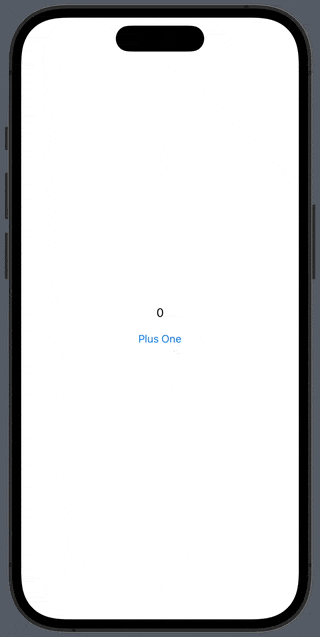

# UIViewRepresentable

- UIKit view를 SwiftUI view hierarchy에 integrate 하기 위한 wrapper
- `UIView`를 SwiftUI interface로 생성 및 관리할 수 있게 한다.
  - `UIView`를 SwiftUI view처럼 생성(create) 및 갱신(update)한다.
  - 이 때, SwiftUI app의 state 정보(`@State`)를 사용해서 view를 설정(configure)할 수 있다.
  - Teardown proecess를 사용해서 `UIView`를 SwiftUI view hierarchy로부터 제거하고, 다른 object들에 알릴 수 있다.

## Required

```swift
@available(iOS 13.0, tvOS 13.0, *)
@available(macOS, unavailable)
@available(watchOS, unavailable)
public protocol UIViewRepresentable : View where Self.Body == Never {
    associatedtype UIViewType : UIView
    typealias Context = UIViewRepresentableContext<Self>

    @MainActor func makeUIView(context: Self.Context) -> Self.UIViewType
    @MainActor func updateUIView(_ uiView: Self.UIViewType, context: Self.Context)
}
```

- `makeUIView(context:)`
    - SwiftUI에서 사용하려는 `UIView`를 생성한다. 
    - `context`를 통해 SwiftUI system information을 가져와서 `UIView` 속성을 설정할 수 있다.
- `updateUIView(_:context:)`
    - `@State`가 변경되는 등 SwiftUI가 view를 새로 그릴 때 마다 호출된다.

### UIKit button을 SwiftUI에서 사용하기

1. `UIButton`을 `UIViewRepresentable`로 wrapping한다.
    ```swift
    import UIKit
    import SwiftUI

    struct UIKitButton: UIViewRepresentable {
        
        let title: String
        
        init(_ title: String) {
            self.title = title
        }
        
        func makeUIView(context: Context) -> UIButton {
            let button = UIButton(type: .system)
            button.setTitle(title, for: .normal)
            return button
        }
        
        func updateUIView(_ uiView: UIButton, context: Context) {
            uiView.setContentHuggingPriority(.defaultHigh, for: .vertical)
            uiView.setContentHuggingPriority(.defaultHigh, for: .horizontal)
        }
    }
    ```
    - `UIViewRepresentable`로 wrapping한 `UIView`는 SwiftUI app에서 기본적으로 전체 화면을 꽉 채우도록 늘어난다.
    - Content size에 딱 맞게 줄이려면 vertical 및 horizontal axis로 hugging priority를 높여준다.
2. `UIViewRepresentable`로 wrapping한 `UIKitButton`을 SwiftUI view와 동일한 interface로 사용한다.
    ```swift
    import SwiftUI

    struct ContentView: View {
        var body: some View {
            VStack {
                Text("0")
                UIKitButton("Plus One") {
                    print("Button Touched")
                }
            }
        }
    }
    ```
3. 실행결과
    <p></p>

## Coordinator

```swift
@available(iOS 13.0, tvOS 13.0, *)
@available(macOS, unavailable)
@available(watchOS, unavailable)
public protocol UIViewRepresentable : View where Self.Body == Never {
    ...

    associatedtype Coordinator = Void
    @MainActor func makeCoordinator() -> Self.Coordinator
}
```

- UIKit에서 SwiftUI로 action 및 data를 전달하는 역할
    - Delegate pattern에서 delegate로 지정하는 object와 같은 역할 (e.g. `UITableView`, `UITableViewDataSource`, `UITableViewDelegate`)
    - SwiftUI app에 추가된 UIKit view에서 `UITableViewDataSource`를 구현해야 할 때,
        1. `UITableViewDataSource`를 채택하는 `Coordinator` 생성
        2. `Coordinator`가 delegate 구현
        3. `makeCoordinator()`에서 생성한 `Coordinator` 반환
    - Target-action 방식으로 발생한 action을 SwiftUI로 전달

### UIKit button에서 발생하는 touch event를 SwiftUI로 전달하기

1. `UIKitButton`에서 생성한 `UIButton`의 target action을 처리할 `Coordinator`를 정의
    ```swift
    extension UIKitButton {
        
        class Coordinator: NSObject {
            
            let action: () -> Void
            
            init(action: @escaping () -> Void) {
                self.action = action
            }
            
            @objc func buttonTouched(_ sender: UIButton) {
                action()
            }
        }
    }
    ```
2. `UIButton`의 target 및 selector를 `Coordinator`로 지정
    ```swift
    func makeUIView(context: Context) -> UIButton {
        let button = UIButton(type: .system)
        button.setTitle(title, for: .normal)
        button.addTarget(
            context.coordinator,
            action: #selector(Coordinator.buttonTouched(_:)),
            for: .touchUpInside
        )
        return button
    }
    ```
3. `UIKitButton`에 SwiftUI에서 설정하는 action property를 추가하고, `Coordinator` 생성 시 action 연결
    ```swift
    struct UIKitButton: UIViewRepresentable {
        let title: String
        let action: () -> ()
        
        init(_ title: String, action: @escaping () -> ()) {
            self.title = title
            self.action = action
        }

        ...

        func makeCoordinator() -> Coordinator {
            Coordinator(action: action)
        }
    }
    ```
4. 실행결과
    <p></p>

## Context

```swift
typealias Context = UIViewRepresentableContext<Self>
```

- SwiftUI에서 UIKit으로 system information을 전달하는 역할 (`coordinator`, `environment`, `transaction`)
- 이 값을 통해 SwiftUI app 정보를 사용해서 `UIView`를 초기화할 수 있다.
    - `Coordinator`는 default instance가 이미 구현되어 있다.
    - `Coordinator`에 delegate 또는 target-action을 구현해 놓은 경우, `UIView`에 delegate 및 target-action을 설정할 때 `context.coordinator`로 추가할 수 있다. 
- Custom data는 stored property 또는 `@Binding` property로 전달한다.

### Coordinator에 있는 selector method를 UIButton에 추가하기

```swift
func makeUIView(context: Context) -> UIButton {
    let button = UIButton(type: .system)
    button.addTarget(
        context.coordinator,
        action: #selector(Coordinator.buttonTouched(_:)),
        for: .touchUpInside
    )
    return button
}
```

### UIKitButton에 modifier 추가하기

- Text color를 변경하는 modifier를 추가한다.
    ```swift
    struct UIKitButton: UIViewRepresentable {

        ...

        private var titleColor = UIColor.tintColor

        ...

        func makeUIView(context: Context) -> UIButton {
            let button = UIButton(type: .system)
            ...
            button.setTitleColor(titleColor, for: .normal)
            ...
            return button
        }
    }

    // MARK: - Modifier

    extension UIKitButton {
    
        func titleColor(_ color: Color) -> UIKitButton {
            var view = self
            view.foregroundColor = UIColor(color)
            return view
        }
    }
    ```
- SwiftUI app에서 이 method를 modifier처럼 호출한다. (Text color를 `.black`으로 변경)
    ```swift
    var body: some View {
        UIKitButton("Plus One") {
            print("Button Touched")
        }
        .titleColor(.black)
    }
    ```
- 실행결과
    <p></p>


# Reference

- https://developer.apple.com/documentation/swiftui/uiviewrepresentable
- https://ios-development.tistory.com/1043
- https://www.hackingwithswift.com/quick-start/swiftui/how-to-create-modifiers-for-a-uiviewrepresentable-struct